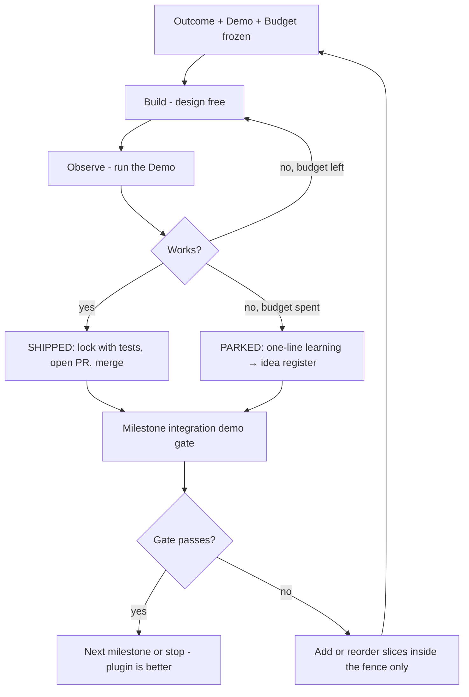

# PRD: Plugin usability, shipped in vertical slices

**Issue**: https://github.com/vfarcic/dot-ai-grafana/issues/8
**PRD**: **#8** (free after #1 v1, #5 GitOps-PR execute, #6 M7 Map, #7 evidence-grounded change safety)
**Priority**: High (finishes the plugin after PRD #1 thin-client + PRD #5 / #6 / #7 roadmap split)
**Status**: Draft — **restructured 2026-09-03** after collision with PRD #6
**Updated**: 2026-09-03

> **Numbering:** Assigned **PRD #8**. Filename `prds/8-plugin-usability-verticals.md`. Do **not** reuse 1/5/6/7: `1` v1 analysis, `5` GitOps-PR execute, `6` M7 Map, `7` evidence-grounded change safety.

## Current State

- **Goal now**: Finish the `dot-ai-grafana` Grafana app plugin as a usable product surface — **thread integrity, honest wait, ship/docs** — without stealing PRD #6 Map/markdown/show-me scope or PRD #7 pre-flight/verify scope.
- **Collision found (2026-09-03):** This draft was written without knowledge of [issue #6](https://github.com/vfarcic/dot-ai-grafana/issues/6). Milestones **M-C** (readable answer / markdown) and **M-E** (act from the answer / drilldowns / 0-hop) overlap **PRD #6** directly. They are **not deleted** — they live under **Deferred to PRD #6** below with Outcome/Demo/Budget preserved.
- **Established split (owner, authoritative):**
  ```
  PRD #1  v1 0.1.0        — analysis-only, pack Current       — vfarcic/dot-ai-grafana#3
  PRD #5  GitOps execute  — issue #5                          — propose → GitOps PR only
  PRD #6  M7 Map          — issue #6                          — 0.2.x
  PRD #7  Evidence safety — issue #7 / prds/7-evidence-grounded-change-safety.md
  PRD #8  Usability rest  — issue #8 / this file — M-A (done), M-B, M-D, M-F + IaC/topology notes
  ```
- **Viktor demarcation (verbatim intent):** Grafana = observability-first intelligence + **GitOps-PR triggering**. Headlamp = day-2 object lifecycle and direct resource actions. Grafana must **not** become a duplicate cluster manager. Analysis-only v1 was **sequencing** ("ship the smaller thing, then open a separate PRD for the GitOps-PR path"), not a permanent ban on execute-via-PR — and that execute path is **PRD #5**, not a new operate wizard.
- **Active milestone**: **M-B — The thread actually works** (next). **M-A is DONE.**
- **M-A complete:** Usability foundation work was committed on a working branch (GFM markdown, Explore/drilldown helpers, structured errors, orchestrator/page/config wiring — product commits on this branch). Clean tree for that set. Product *delivery ownership* of Map / markdown / show-me remains **PRD #6**.
- **Next action**: Open slice **B1** — History reaches dot-ai within the char budget. Do not implement Map/markdown/show-me here; track via PRD #6.
- **Method**: lab-notebook-shaped (see **How this PRD works**). Iteration is compliance. PARKED is a success exit.
- **IaC / KRO position (2026-09-03):** Written. Two-cluster split; plugin stays orchestrator-neutral; abstraction→child evidence packing in-scope **here**. Parent host-cluster visibility is platform/engine.
- **Topology visualization (2026-09-03):** Tier 1 surface `visualizationUrl`; tiers 2–3 OPEN. Not PRD #6 scope.
- **PRD #7 (2026-09-03 reframed):** Not Build/Update-in-Grafana. **Pre-flight** `impact_analysis` + live telemetry, and **post-merge** metric verification around the PRD #5 GitOps-PR path. Build/Update ideas kept as **Considered and deferred** on PRD #7 (Headlamp owns day-2 lifecycle).

> This section outranks everything below it. When work lands, rewrite **Current State** here and demote the previous body to **Decision History** — never delete it.

## Boundary map — who owns what

Source of PRD #6 truth: `prds/6-m7-grafana-map.md` / [issue #6](https://github.com/vfarcic/dot-ai-grafana/issues/6).

### Milestones and slices

| id | owner | justification / note |
|----|-------|----------------------|
| M-A | this-PRD | Landing complete on this branch; markdown/Explore code product-owned by PRD #6 |
| A1 | this-PRD |  |
| A2 | this-PRD |  |
| A3 | this-PRD |  |
| A4 | this-PRD |  |
| M-B | this-PRD |  |
| B1 | this-PRD |  |
| B2 | this-PRD |  |
| B3 | this-PRD |  |
| B4 | this-PRD |  |
| B5 | this-PRD |  |
| M-C | PRD-6 | Deferred whole milestone; C1 is PRD #6 core (markdown); C2–C4 residual this-PRD polish parked under deferred until PRD #6 base lands |
| C1 | PRD-6 | PRD #6 Scope: markdown Answer via renderMarkdown |
| C2 | this-PRD | Not in PRD #6 stated scope (raw toggle / copy / char counter); residual this-PRD; section lives under Deferred with M-C |
| C3 | this-PRD | Not in PRD #6 stated scope (raw toggle / copy / char counter); residual this-PRD; section lives under Deferred with M-C |
| C4 | this-PRD | Not in PRD #6 stated scope (raw toggle / copy / char counter); residual this-PRD; section lives under Deferred with M-C |
| M-D | this-PRD |  |
| D1 | this-PRD |  |
| D2 | this-PRD |  |
| D3 | this-PRD |  |
| D4 | this-PRD |  |
| M-E | PRD-6 | Deferred whole milestone; E1–E2 are PRD #6 core (Map chips / show-me nav); E3 residual this-PRD |
| E1 | PRD-6 | PRD #6 Scope: Explore panes + Drilldown Map links |
| E2 | PRD-6 | PRD #6 Scope: show-me skip POST + navigation |
| E3 | this-PRD | Not in PRD #6 stated scope (Analyze-this handoff); residual this-PRD under Deferred with M-E |
| M-F | this-PRD |  |
| F1 | this-PRD |  |
| F2 | this-PRD |  |
| F3 | this-PRD |  |
| F4 | this-PRD |  |
| F5 | this-PRD |  |

### Idea rows I-001 … I-085

| id | title | owner | justification / note |
|----|-------|-------|----------------------|
| I-001 | Ship Grafana Cloud edge path | out-of-scope | OUT-OF-SCOPE (self-managed track; PRD #1 design choice) |
| I-002 | Enforce SSRF egress allowlist | this-PRD | — |
| I-003 | Forward Grafana user identity | this-PRD | — |
| I-004 | Wire shared-server dual surface | this-PRD | — |
| I-005 | Codify Grafana vs Headlamp roles | this-PRD | — |
| I-006 | Surface GitOps-PR remediation | PRD-8 | GitOps-PR remediate execute path (issue #5) — do not duplicate |
| I-007 | Register mcp-grafana senses | out-of-scope | OUT-OF-SCOPE (core `vfarcic/dot-ai`) |
| I-008 | Add Kubeshark MCP evidence | out-of-scope | OUT-OF-SCOPE (core `vfarcic/dot-ai`) |
| I-009 | Ingest predictive hardware metrics | out-of-scope | OUT-OF-SCOPE (core `vfarcic/dot-ai`) |
| I-010 | Render evidence-tier fields | out-of-scope | OUT-OF-SCOPE (after core evidence lands) |
| I-011 | Document read-analyze RBAC role | this-PRD | — |
| I-012 | Finalize plugin id and home | this-PRD | F3 |
| I-013 | Set Grafana version floor | this-PRD | F2 |
| I-014 | Plan catalog signing path | this-PRD | F4 |
| I-015 | Async 202 job-poll remediate | this-PRD | D4 |
| I-016 | Position against Grafana Assistant | this-PRD | F1 |
| I-017 | Own optional Cloud follow-on | out-of-scope | OUT-OF-SCOPE (optional follow-on; not this track) |
| I-018 | Keep Kubeshark in core | out-of-scope | OUT-OF-SCOPE (confirmed core-owned; design choice) |
| I-019 | Finish install docs and screenshots | this-PRD | F1 |
| I-020 | Run multi-version Grafana matrix | this-PRD | F2 |
| I-021 | Document no-apply vs PR tokens | PRD-8 | GitOps-PR remediate execute path (issue #5) — do not duplicate |
| I-022 | UI propose GitOps PR | PRD-8 | GitOps-PR remediate execute path (issue #5) — do not duplicate |
| I-023 | Create PRs via SCM API | PRD-8 | GitOps-PR remediate execute path (issue #5) — do not duplicate |
| I-024 | Gate who may open PRs | PRD-8 | GitOps-PR remediate execute path (issue #5) — do not duplicate |
| I-025 | E2E proposal to GitOps PR | PRD-8 | GitOps-PR remediate execute path (issue #5) — do not duplicate |
| I-026 | Expand operate and recommend | PRD-7-new | Recorded on PRD #7 as Considered-and-deferred (Headlamp owns day-2 lifecycle; not Grafana Build/Update) |
| I-027 | Rich in-UI diff viewer | PRD-8 | GitOps-PR remediate execute path (issue #5) — do not duplicate |
| I-028 | Generate OpenAPI typed client | this-PRD | — |
| I-029 | Backend 202 status polling | this-PRD | D4 |
| I-030 | Show 1000-character counter | this-PRD | C4 |
| I-031 | Toggle raw REST response | this-PRD | C2 |
| I-032 | Automate live REST validation | this-PRD | — |
| I-033 | Record healthy-path latency | this-PRD | — |
| I-034 | Fix remediate JSON parse error | out-of-scope | OUT-OF-SCOPE (upstream engine bug on `vfarcic/dot-ai`) |
| I-035 | Instrument Tempo in the stack | this-PRD | — |
| I-036 | Sync Playwright mocks to envelope | this-PRD | — |
| I-037 | Gate public-surface secrets check | this-PRD | — |
| I-038 | Auto-run next MVP after /prd next | out-of-scope | OUT-OF-SCOPE (factory/ADW — not plugin) |
| I-039 | Fallback when ADW ledger missing | out-of-scope | OUT-OF-SCOPE (factory/ADW — not plugin) |
| I-040 | Allowlist read-only git in harness | out-of-scope | OUT-OF-SCOPE (harness — not plugin) |
| I-041 | Separate fact reads from mutations | out-of-scope | OUT-OF-SCOPE (harness — not plugin) |
| I-042 | Default worktree-first edits | out-of-scope | OUT-OF-SCOPE (harness — not plugin) |
| I-043 | Render GFM answer markdown | PRD-6 | PRD #6 Success: Answer renders markdown |
| I-044 | Build Explore drilldown URLs | PRD-6 | PRD #6 Scope: Explore panes URL + Drilldown apps |
| I-045 | Attach drilldowns on stack hits | PRD-6 | PRD #6 Scope: Map links from stack/Current |
| I-046 | Classify pure navigation asks | PRD-6 | PRD #6 Scope: isShowMeOnly contract |
| I-047 | Structure Ask error taxonomy | this-PRD | A1,A2 |
| I-048 | Document unsigned plugin allow-list | this-PRD | F4 |
| I-049 | Capture current UI screenshots | this-PRD | F1 |
| I-050 | Honor AppConfig privacy toggles | this-PRD | A3 |
| I-051 | Send condensed History to dot-ai | this-PRD | B1 |
| I-052 | Keep prompt text after submit | this-PRD | B2 |
| I-053 | Show other tool thread badge | this-PRD | B3 |
| I-054 | Confirm before Clear thread | this-PRD | B4 |
| I-055 | Retry last submitted intent | this-PRD | B5 |
| I-056 | Copy answer to clipboard | this-PRD | C3 |
| I-057 | Show multi-hop progress phases | this-PRD | D1 |
| I-058 | Explain extra hops with badges | this-PRD | D2 |
| I-059 | Preserve raw Grafana evidence | this-PRD | D3 |
| I-060 | Drilldowns as clickable chips | PRD-6 | PRD #6 Scope: Map Explore/Drilldown human click path |
| I-061 | Navigate on pure show-me asks | PRD-6 | PRD #6 Scope: show-me skip POST + open Map links |
| I-062 | Clean Analyze-this handoff | this-PRD | E3 |
| I-063 | Land stack on upstream repo | Propose/merge the usability stack toward upstream `vfarcic/dot-ai-grafana` (building on open `vfarcic/dot-ai-grafana#3`), not only a personal fork. Visible change: upstream PR(s) with CI green and maintainer review requested. | `vfarcic/dot-ai-grafana#3` | process | SCHEDULED | F5 |
| I-064 | Session handoff skill | out-of-scope | OUT-OF-SCOPE (process/factory — not plugin) |
| I-065 | Freeze Outcome Demo Budget | this-PRD | KILLED (already the governing method of this PRD) |
| I-066 | Track ideas mid-loop | this-PRD | KILLED (already rule 5 of this register) |
| I-067 | Allow PARKED success exit | this-PRD | KILLED (already encoded in slice exit rules) |
| I-068 | Demo gate not test suite | this-PRD | KILLED (already the slice Demo-gate rule) |
| I-069 | Resolve abstraction children for stack evidence | this-PRD | — |
| I-070 | Resolve abstraction children for Explore links | this-PRD | — |
| I-071 | Name parent abstraction in answers | this-PRD | — |
| I-072 | Detect cross-cluster managed workloads | this-PRD | — |
| I-073 | Connect dot-ai to host KRO namespaces | out-of-scope | OPEN |
| I-074 | Refresh stale capability scan index | out-of-scope | OPEN |
| I-075 | Stay orchestrator-neutral in plugin | this-PRD | KILLED (deliberate — orchestrator-neutral by design; PRD #1 design choice thin-client boundary) |
| I-076 | Leave detail-page actions to Headlamp | out-of-scope | OUT-OF-SCOPE (Headlamp owns; vfarcic/dot-ai-headlamp src/index.tsx) |
| I-077 | Leave Recommend wizard to Headlamp | PRD-7-new | Recorded on PRD #7 as Considered-and-deferred (Headlamp owns day-2 lifecycle; not Grafana Build/Update) |
| I-078 | Consider Knowledge Base on Grafana | this-PRD | — |
| I-079 | Diff claim not children in GitOps PR | PRD-8 | GitOps-PR remediate execute path (issue #5) — do not duplicate |
| I-080 | Surface existing visualizationUrl | this-PRD | — |
| I-081 | Embed visualization in-page | this-PRD | — |
| I-082 | Render topology with Node Graph | this-PRD | — |
| I-083 | Decide when a diagram helps | this-PRD | — |
| I-084 | Add Headlamp-style renderer layer | this-PRD | — |
| I-085 | Degrade cleanly without webUI.baseUrl | this-PRD | — |

### Owner counts

| owner | milestones+slices | idea rows (I-001…I-085) |
|-------|-------------------|-------------------------|
| this-PRD | 26 | 52 |
| PRD-6 | 5 (M-C, C1, M-E, E1, E2) | 6 |
| PRD-8 | 0 | 8 |
| PRD-7-new | 0 | 2 (I-026, I-077 — recorded as considered-and-deferred on PRD #7; active PRD #7 work is I-086…) |
| PRD-1 | 0 | 0 (no row sole-owned here; several *originated* in PRD #1 docs) |
| out-of-scope | 0 | 17 |

Every milestone, slice, and idea id has **exactly one** owner above.

## Problem

Three facts, each load-bearing — **updated after the PRD #6 collision**:

**(a) Uncommitted value was the single largest risk — now closed for M-A.** The 2026-09-02/03 usability delta is **versioned on `working branch`**. Remaining risk is **scope collision** and unfinished thread/wait/ship work.

**(b) Capability is still ahead of the UX contract on thread integrity.** Follow-ups must reach dot-ai inside the char budget (`src/utils/progressiveContext.ts`; UsabilityGaps gap #1). That is **this PRD (M-B)**, not PRD #6.

**(c) Open Viktor / roadmap points are split across PRDs.** GitOps-PR remediate execute → **PRD #5** (the execute path he blessed for Grafana). Map / markdown / show-me → **PRD #6**. Evidence-grounded pre-flight + post-merge verify → **PRD #7**. Async 202 + job-poll, positioning vs Grafana Assistant, plugin identity/slug → **this PRD** (M-D / M-F). Day-2 object lifecycle / Recommend live wizard → **Headlamp**, not a Grafana Build/Update PRD.

## How this PRD works

The owner works **prototype → test → new idea → repeat**, and demanded that **every idea is tracked and documented**. This PRD is therefore a lab notebook, not a task list. PRD #1's `- [x] Query tool UI` milestones can only be obeyed or violated; the moment a better idea appears they go stale. Here, changing your mind mid-slice is **compliance**.

### 1. Slice contract — three fields frozen, everything else free

| Field | Frozen? | Meaning |
|-------|---------|---------|
| **Outcome** | YES | The observable user behaviour. Changing it makes it a *different slice*. |
| **Demo** | YES | The literal clicks/commands a human runs to see it work. **This is the gate** — not a test suite. |
| **Budget** | YES | Loop cap (default **3**) or timebox. Spent = forced exit. |
| Design, files, approach, number of loops | NO | Free to change every loop. |

Because *how* is never written down as law, rewriting the approach is not scope creep.

### 2. Loop log replaces the task list

Inside each slice, an **append-only** log:

```
### Loop 2 — YYYY-MM-DD
Tried:    <what you built>
Observed: <what actually happened>
Verdict:  KEEP | KILL -> <next idea>
```

**A slice with 4 recorded loops is HEALTHY.** It means the method is being used. Empty logs at ship time are a process smell, not a virtue.

Worked example (shape only — not a real run):

```
### Loop 1 — 2026-09-04
Tried:    Append last You+Answer pair into buildRequestText under the 1000-char budget
Observed: Follow-up "describe the first one" still missed the pod name; Map ate the budget first
Verdict:  KILL -> drop Map before History; keep 1 condensed turn max

### Loop 2 — 2026-09-04
Tried:    Condensed prior turn after Stable, before Current; drop Map when over budget
Observed: Network intent payload contains prior pod name; answer names the pod
Verdict:  KEEP
```

### 3. Exactly two legal exits per slice — never a third

- **`SHIPPED`** — demo passes, tests added to lock the behaviour, PR opened, merged.
- **`PARKED`** — budget spent, one-line learning recorded, idea returned to the register with status `PARKED (why)`.

No "in progress forever". **PARKED is a success state** — it is the mechanism that stops one vertical eating a milestone. Slice **D4** (async 202 + job-poll) is the document's worked example: if its budget spends, it exits PARKED and escalates to a core `vfarcic/dot-ai` PRD rather than expanding this one.

### 4. The milestone is the fence

A milestone = **3–5 slices + ONE integration demo**. Inside the fence you may add, reorder, or kill slices freely. You may **not** add a slice that does not serve the milestone's integration demo. Freedom inside; hard edge at the boundary.

### 5. Idea register is the pressure valve (first-class)

New idea mid-loop → **one line in the register**, keep working the current Outcome/Demo. Triage only at milestone close. Append-only: ideas are **never deleted**, only dispositioned `OPEN` / `SCHEDULED (slice)` / `PARKED (why)` / `KILLED (why)` / `OUT-OF-SCOPE (owner)`.

### 6. Every milestone ships independently

Stop after any one milestone and the plugin is **strictly better than before**. That is the anti-big-bang property. M-A alone (landed uncommitted work) already de-risks the project even if M-B…M-F never start.

### Loop diagram



### What this PRD deliberately does not contain

- **No upfront design** for slices beyond the **current** milestone. Later milestones carry **outcome names only** until they become current. That is what kills the big-bang.
- No checkbox task list that can go stale the moment a better approach appears.
- No requirement to finish every OPEN idea. Completeness of the **register** ≠ commitment to build.

## Milestones — this PRD's fence only

**Explicitly NOT in this PRD**

- **GitOps-PR remediate execute** → [`prds/5-gitops-pr-remediate.md`](./5-gitops-pr-remediate.md) (I-006, I-021–I-025, I-079). Do not duplicate.
- **Grafana Map / Explore / show-me / markdown Answer (M7)** → PRD #6 on [issue #6](https://github.com/vfarcic/dot-ai-grafana/issues/6). Deferred slices preserved below.
- **Evidence-grounded change safety (pre-flight + post-merge verify)** → [`prds/7-evidence-grounded-change-safety.md`](./7-evidence-grounded-change-safety.md).
- **Day-2 Build/Update object lifecycle** → Headlamp (see PRD #7 Considered and deferred). Not this fence.
- **Phase-3 core-engine work** (I-007–I-010, I-018) stays on `vfarcic/dot-ai`. Thin REST client (PRD #1 design choice).

---

### M-A — Land what exists

**Fence:** De-risking, not design. Commit and PR the uncommitted usability work in reviewable chunks with tests. May split commits/PRs; may not invent new UX behaviour beyond what already exists in the working tree (wiring half-built toggles counts as landing, not inventing).

**Status (milestone):** **DONE** — usability delta committed on `working branch` in the 10 product commits after the de-number docs commit (see Work Log). Product *ownership* of markdown / Explore / show-me still sits with PRD #6 (issue #6); this milestone only de-risked the working tree.

**Integration demo:** From a clean clone of the PR branch: `git status` clean for the usability set, CI green, plugin loads in Grafana, Ask returns a GFM-rendered answer, Map shows Explore/drilldown links, a forced error shows a structured title — and AppConfig `showContext` / `sendGrafanaEvidence` toggles affect the page.

#### A1 — Inventory and commit uncommitted usability delta

- **Outcome:** The 1245-line / 24-file delta plus 3 untracked module/test pairs is versioned on a branch and reviewable; nothing of product value remains only in the working tree.
- **Demo:** `git status --short` shows no pending product changes for the usability set; `git log -1 --stat` lists `ResponseMarkdown`, `grafanaExplore`, `askErrors`, and the modified orchestrator/page/stack files; PR link opens.
- **Budget:** 3 loops
- **Status:** DONE (landed on `working branch`)
- **Evidence:** ForkDelta uncommitted inventory; `git diff --stat` → 1245 insertions / 24 files; I-043, I-044, I-045, I-046, I-047
- **Loop log:** *(empty — append on each loop)*

#### A2 — Tests lock GFM, Explore helpers, and error taxonomy

- **Outcome:** The three new modules have automated tests that fail if rendering, URL builders, or error titles regress.
- **Demo:** Targeted test run for `ResponseMarkdown`, `grafanaExplore`, and `askErrors` is green; deliberately breaking a title string or Explore URL builder makes the matching test red.
- **Budget:** 3 loops
- **Status:** DONE (landed on `working branch`)
- **Evidence:** `src/components/ResponseMarkdown.test.tsx`, `src/utils/grafanaExplore.test.ts`, `src/utils/askErrors.test.ts` (untracked pairs); I-043, I-044, I-047
- **Loop log:** *(empty)*

#### A3 — Wire AppConfig `showContext` / `sendGrafanaEvidence` through runtime

- **Outcome:** Saved `jsonData.showContext` and `jsonData.sendGrafanaEvidence` actually control Map/Current/History visibility and whether Grafana evidence is packed into Ask (half-built #4).
- **Demo:** In Configuration, turn **off** "send Grafana evidence", Save, reload Ask page — consent banner gone and Network intent has no Loki/Prom block. Turn **off** "show context", Save, reload — Map/Current/History hidden after an answer. Turn both back on — behaviour restored.
- **Budget:** 3 loops
- **Status:** DONE (landed on `working branch`)
- **Evidence:** ForkDelta half-built #4; `src/components/AppConfig/AppConfig.tsx:12-13,97-99,131-133,240-259`; `src/components/App/App.tsx:10-15`; `src/pages/DotAIPage.tsx:30-35,76,169,280,302,316`; I-050
- **Loop log:** *(empty)*

#### A4 — PR open, CI green, plugin loads

- **Outcome:** The landed work is proposed upstream/fork with green CI and a human-visible load of the plugin page.
- **Demo:** Open the PR in the browser; CI checks are green; Grafana loads `/a/<plugin-slug>/` without unsigned-plugin crash (or with documented allow-list); submit a simple Ask and see a non-plain-text answer.
- **Budget:** 3 loops
- **Status:** DONE (landed on `working branch`)
- **Evidence:** Open PR trail `vfarcic/dot-ai-grafana#3`, `prior working branch`; I-019 (partial — load smoke only)
- **Loop log:** *(empty)*


---

### M-B — The thread actually works

**Fence:** Conversation integrity only — history reaches dot-ai, prompt text survives, tool-switch honesty, clear-thread safety. Not answer formatting, not async jobs, not drilldown chrome.

**Integration demo:** Ask "show pods in prod" → Ask "describe the first one" and the second answer names a real pod from the first turn; prompt text still editable after submit; tool Select shows the other tool's turn count; Clear thread asks before wiping.

#### B1 — History reaches dot-ai within the char budget

- **Outcome:** Follow-up questions include condensed prior turn(s) inside `MAX_INTENT_CHARS` so dot-ai can resolve references like "the first one" (gap #1).
- **Demo:** Submit "show pods in prod", then "describe the first one". DevTools Network → POST body `intent` contains a prior-turn fragment and/or pod name from turn 1; answer refers to a concrete pod. (`src/utils/progressiveContext.ts:85-86` today: "History is intentionally omitted.")
- **Budget:** 3 loops
- **Status:** NOT STARTED
- **Evidence:** UsabilityGaps gap #1; `progressiveContext.ts:4-5,85-89`; `DotAIPage.tsx:316-322`; I-051
- **Loop log:** *(empty)*

#### B2 — Prompt text survives submit

- **Outcome:** After a successful Ask, the textarea still holds the submitted prompt (or one-click reuse from History) so typos and tweaks do not require full retype (gap #2).
- **Demo:** Submit "show pods in ns dev"; answer renders; textarea still contains that string and remains editable without retyping from History.
- **Budget:** 3 loops
- **Status:** NOT STARTED
- **Evidence:** UsabilityGaps gap #2; `DotAIPage.tsx:88` (`setIntent('')`); I-052
- **Loop log:** *(empty)*

#### B3 — Tool-switch reveals the other thread's turn count

- **Outcome:** Query and Remediate stop looking like a wiped conversation when switching tools (gap #6).
- **Demo:** Ask 2 questions in Query; switch to Remediate; Select (or adjacent badge) shows Query holds 2 turns / non-empty; switch back and thread is intact.
- **Budget:** 3 loops
- **Status:** NOT STARTED
- **Evidence:** UsabilityGaps gap #6; `DotAIPage.tsx` dual `threads` state; I-053
- **Loop log:** *(empty)*

#### B4 — Clear thread confirms

- **Outcome:** Clear thread cannot single-click destroy Current/Map/History/Answer (gap #7).
- **Demo:** Click **Clear thread** → see confirm step → cancel leaves thread intact → confirm clears only the active tool thread.
- **Budget:** 2 loops
- **Status:** NOT STARTED
- **Evidence:** UsabilityGaps gap #7; `DotAIPage.tsx:125-128,235-238`; I-054
- **Loop log:** *(empty)*

#### B5 — Retry uses last submitted intent

- **Outcome:** Retry resubmits the last Ask even if the textarea was cleared or edited after failure (gap #8).
- **Demo:** Submit a query that errors; clear the textarea; click **Retry**; the original question resubmits and Network shows the original intent.
- **Budget:** 2 loops
- **Status:** NOT STARTED
- **Evidence:** UsabilityGaps gap #8; I-055
- **Loop log:** *(empty)*

---

### M-D — The wait is honest

**Fence:** Honesty during and after the wait — phase progress, hop badges, preserved raw Grafana evidence, and one **budget-capped** async slice. Not GitOps execute. Not new evidence sources.

**Integration demo:** Unscoped Ask shows phase text through stack → hop 1 → hop 2; hop badge explains why a second hop ran; Current accordion still has raw Loki/Prom lines; multi-minute remediate either polls a job or this milestone records D4 as PARKED with an escalation note.

#### D1 — Phase-by-phase progress instead of a static spinner

- **Outcome:** Loading UI names the current phase (gap #3), not only "Waiting for dot-ai…".
- **Demo:** Submit an unscoped query; loading text changes through at least "Querying Grafana evidence…" and "Querying dot-ai (hop 1/…)" before the answer (or error) appears. (`DotAIPage.tsx:253-254` today is static.)
- **Budget:** 3 loops
- **Status:** NOT STARTED
- **Evidence:** UsabilityGaps gap #3; `askOrchestrator.ts` hop loop; I-057
- **Loop log:** *(empty)*

#### D2 — Hop badges explain extra hops

- **Outcome:** When the orchestrator takes branch `across` / `conflict` / `hedge`, the UI shows hop count and why (half-built #3).
- **Demo:** Trigger a conflict or unscoped multi-hop Ask; UI shows e.g. hop 2/3 + branch reason; single-hop Ask shows hop 1 or hides badge cleanly. Meta already exists as `AskMeta.hop/hops/branch` in `askOrchestrator.ts:27-32`.
- **Budget:** 3 loops
- **Status:** NOT STARTED
- **Evidence:** ForkDelta half-built #3; `askOrchestrator.ts:27-32,263-267`; I-058
- **Loop log:** *(empty)*

#### D3 — Raw Grafana evidence preserved and shown

- **Outcome:** Raw stack Current is not destroyed by `rewriteCurrent`; operator can inspect what the model was fed (gap #4).
- **Demo:** Submit a pod log query; open Current; see raw Loki lines and/or Prom metrics **and** any summary — not summary alone. (`progressiveContext.ts:231-232` rewrites; `DotAIPage.tsx` Current defaults collapsed.)
- **Budget:** 3 loops
- **Status:** NOT STARTED
- **Evidence:** UsabilityGaps gap #4; `progressiveContext.ts:231-232`; I-059
- **Loop log:** *(empty)*

#### D4 — Async 202 + job-poll (budget-capped; PARKED is success)

- **Outcome:** Multi-minute remediate survives Grafana resource deadlines via **202 + jobId + UI poll**, **or** this slice exits **PARKED** with a one-line learning and an explicit escalation owner on `vfarcic/dot-ai` — without expanding this PRD's fence.
- **Demo (SHIPPED path):** Trigger a long remediate; observe 202 + poll updates; final analysis renders without a 120s hard fail.
- **Demo (PARKED path):** After budget loops, register row status `PARKED (needs core job API)`; link or name the core PRD/issue owner; plugin still documents the 120s ceiling honestly.
- **Budget:** 3 loops — **do not raise the budget to "finish" this**. Spent budget → PARKED.
- **Status:** NOT STARTED
- **Evidence:** Viktor open point #3; I-015, I-029; `docs/test-loop.md:30`; PRD #1 OQ5
- **Why PARKED is success here:** Async job protocol is largely a **core engine + gateway** contract. Burning unlimited plugin loops on it recreates the big-bang this PRD exists to prevent.
- **Loop log:** *(empty — this slice is the worked example for PARKED)*

---

### M-F — Ship it

**Fence:** Packaging, identity, docs, and upstream landing. No new Ask behaviour except what docs require to be true.

**Integration demo:** A stranger can install from README (with unsigned allow-list notes), see screenshots that match the UI, know the Grafana version matrix, know the plugin slug decision (or explicit written owner if still negotiating), and the stack is proposed on `vfarcic/dot-ai-grafana`.

#### F1 — README / install guide + screenshots + positioning

- **Outcome:** End-to-end install and first-Ask docs exist with current screenshots (I-019, I-049), and README states the honest wedge vs Grafana Assistant: live K8s API state + sovereign/self-managed + (via PRD #5) GitOps remediate — not an NL telemetry chat clone (I-016; Viktor open point 2).
- **Demo:** Follow README from zero on a reference Grafana 11.4-class instance; reach first successful Ask without undocumented steps; screenshots match the live UI; "Why not Grafana Assistant?" (or equivalent) is readable in 60 seconds, links PRD #5 for execute, and never claims in-plugin `kubectl apply`.
- **Budget:** 3 loops
- **Status:** NOT STARTED
- **Evidence:** I-019, I-049, I-016; `README.md` placeholders; PRD #1 competitive expansion; ViktorFeedback point 2
- **Loop log:** *(empty)*

#### F2 — Grafana version compatibility matrix

- **Outcome:** Published matrix of tested Grafana versions and the supported floor (I-013, I-020).
- **Demo:** Docs table lists must-pass 11.4 and other CI matrix versions with pass/fail; floor policy matches PRD #1 design choice (≥11.0).
- **Budget:** 3 loops
- **Status:** NOT STARTED
- **Evidence:** I-013, I-020; `docs/test-loop.md` B1 notes
- **Loop log:** *(empty)*

#### F3 — Plugin identity / slug resolution with Viktor

- **Outcome:** Canonical plugin id is **`devopstoolkit-dotai-app`** everywhere (I-012 RESOLVED with PRD #1 design choice/OQ2; Viktor open point 5 closed on identity).
- **Demo:** `plugin.json` / package id / README / deep links / unsigned allow-list all use **`devopstoolkit-dotai-app`** (matches upstream PR #3 and reviewed `plugin working branch`). Retired fork drift slug `retired-personal-dotai-app` must not reappear.
- **Budget:** 3 loops
- **Status:** DONE (identity resolution landed; remaining install-doc polish is F4)
- **Evidence:** I-012 RESOLVED; PRD #1 design choice/OQ2 RESOLVED; IdentityFix; upstream PR #3 / `src/plugin.json` / `pkg/main.go`
- **Loop log:** *(identity closed 2026-09-03 — canonical `devopstoolkit-dotai-app`; retired `retired-personal-dotai-app`)*

#### F4 — Unsigned-loading documentation

- **Outcome:** Private/alpha install documents `GF_PLUGINS_ALLOW_LOADING_UNSIGNED_PLUGINS` (and limits) clearly (I-014, I-048).
- **Demo:** A reader following only the unsigned section can load the plugin; docs state catalog signing is later.
- **Budget:** 2 loops
- **Status:** NOT STARTED
- **Evidence:** I-014, I-048; PRD #1 design choice / OQ4; `README.md:32`
- **Loop log:** *(empty)*

#### F5 — Land the stack on `vfarcic/dot-ai-grafana`

- **Outcome:** Usability stack is proposed/merged toward upstream `vfarcic/dot-ai-grafana` (building on open `vfarcic/dot-ai-grafana#3` and fork fix PRs), not only on the personal fork.
- **Demo:** Upstream PR shows the landed usability commits (or a clear stack of PRs); CI on that PR green; maintainer review requested.
- **Budget:** 3 loops
- **Status:** NOT STARTED
- **Evidence:** ForkDelta PR table (`vfarcic/dot-ai-grafana#3`, `prior working branch`); I-063
- **Loop log:** *(empty)*

---

## Deferred to PRD #6 (issue #6)

**Owner:** [PRD #6 — Grafana Map / Explore / show-me (M7)](https://github.com/vfarcic/dot-ai-grafana/issues/6) · file `prds/6-m7-grafana-map.md`.

**Why deferred:** This draft's **M-C** and **M-E** were authored without the owner's split. PRD #6 already owns delivery of markdown Answer, Map Explore/Drilldown links, show-me skip POST, `dashboardUid` → `/d/<uid>`, and collapse Current. **Nothing below is deleted.** Outcome / Demo / Budget are frozen verbatim for audit and for residual slices that are *not* in PRD #6's stated scope (see boundary map: C2–C4, E3 remain **this-PRD** residual polish once PRD #6 lands the base).

**Do not implement Map/markdown/show-me in this PRD's active fence.** Cross-link and wait on PRD #6 (or residual follow-ups after it).

### Residual vs PRD #6 core (read before scheduling)

| slice | boundary-map owner | note |
|-------|--------------------|------|
| C1 Markdown polish locked | **PRD-6** | PRD #6 success criterion: Answer renders markdown |
| C2 Raw-response toggle | **this-PRD** | Not in PRD #6 scope |
| C3 Copy answer | **this-PRD** | Not in PRD #6 scope |
| C4 1000-character counter | **this-PRD** | Not in PRD #6 scope |
| E1 Drilldown chips | **PRD-6** | PRD #6 Map Explore/Drilldown |
| E2 0-hop navigation | **PRD-6** | PRD #6 show-me contract |
| E3 Analyze-this handoff | **this-PRD** | Not in PRD #6 scope |

---

### M-C — The answer is readable

**Fence:** Presentation of the answer body only — markdown polish, raw toggle, copy, char counter. Not loading UX, not history packing, not navigation chips.

**Integration demo:** A long markdown answer renders with headings/lists/code; user toggles raw payload; copies answer to clipboard; types past ~900 chars and sees the 1000-char counter warn before submit.

#### C1 — Markdown polish locked

- **Outcome:** Answers render as sanitized GFM via Grafana's `renderMarkdown` with stable styling for headings, lists, tables, code (I-043).
- **Demo:** Ask something that returns markdown lists + a code fence; Answer section shows formatted HTML (not a single pre block of raw `**bold**`); no script execution from fenced content.
- **Budget:** 3 loops
- **Status:** NOT STARTED
- **Evidence:** `src/components/ResponseMarkdown.tsx:12`; I-043
- **Loop log:** *(empty)*

#### C2 — Raw-response toggle

- **Outcome:** Operator can switch between human summary and full REST payload (I-031).
- **Demo:** After a successful Ask, toggle **Show raw response**; raw JSON/envelope (or full tool payload) appears; toggle back to summary markdown.
- **Budget:** 3 loops
- **Status:** NOT STARTED
- **Evidence:** `docs/test-loop.md:37`; PRD #1 design choice / Validation #5; I-031
- **Loop log:** *(empty)*

#### C3 — Copy answer

- **Outcome:** One control copies the answer text the operator sees (summary or raw, matching the active toggle).
- **Demo:** Click **Copy**; paste into an editor; content matches the visible answer.
- **Budget:** 2 loops
- **Status:** NOT STARTED
- **Evidence:** I-056 (register); pairs with I-043/I-031
- **Loop log:** *(empty)*

#### C4 — 1000-character counter

- **Outcome:** The intent/issue box shows live remaining/used count against the 1000-char tool limit before submit (I-030).
- **Demo:** Type until ~950 chars; counter visible and warns; at 1000+ submit stays blocked or clearly explains truncation — behaviour matches `MAX_INTENT_CHARS`.
- **Budget:** 2 loops
- **Status:** NOT STARTED
- **Evidence:** `docs/test-loop.md:37`; `progressiveContext.ts` `MAX_INTENT_CHARS`; I-030
- **Loop log:** *(empty)*


---

### M-E — Act from the answer

**Fence:** Turning an answer into the next human action inside Grafana — drilldown chips, real 0-hop navigation, clean Analyze-this handoff. Not execute/apply. Not new tools.

**Integration demo:** After a logs-oriented Ask, chip buttons open Explore/drilldowns; "show me logs" 0-hop lands the operator in Explore (or equivalent navigation) without an LLM wait; **Analyze this** prefills Remediate with a clean problem statement.

#### E1 — Drilldown links as interactive chips

- **Outcome:** Drilldowns are real UI chips beside the answer, not only raw `<a>` inside the Map text block (half-built #1).
- **Demo:** After an Ask with stack hits, chips for Logs/Metrics/Traces/Dashboard are clickable beside Answer; click opens the right Grafana Explore or drilldown app URL from `buildDrilldownLinks()`.
- **Budget:** 3 loops
- **Status:** NOT STARTED
- **Evidence:** ForkDelta half-built #1; `grafanaExplore.ts`; `DotAIPage.tsx` Map block; I-044, I-045, I-060
- **Loop log:** *(empty)*

#### E2 — 0-hop navigation actually navigates

- **Outcome:** Pure navigation asks (`isShowMeOnly`) take the operator to Grafana evidence/Explore rather than only dumping link text into Map (half-built #2 / I-046).
- **Demo:** Ask "show me logs"; no multi-second LLM spinner; land in Explore (or in-page equivalent) with a LogQL context, or a single primary navigation CTA that is impossible to miss.
- **Budget:** 3 loops
- **Status:** NOT STARTED
- **Evidence:** ForkDelta half-built #2; `grafanaExplore.ts` `isShowMeOnly`; `askOrchestrator.ts` import path; I-046, I-061
- **Loop log:** *(empty)*

#### E3 — Analyze this hands over a clean problem statement

- **Outcome:** Remediate issue box receives a human problem statement, not the structured `Resources: / Asked: / What's true now:` preamble (gap #5).
- **Demo:** After a Query answer, click **Analyze this**; issue textarea shows a clean sentence an on-call can edit; submit still produces analysis-only remediate (no execute fields).
- **Budget:** 3 loops
- **Status:** NOT STARTED
- **Evidence:** UsabilityGaps gap #5; `DotAIPage.tsx:146-147`; ForkDelta half-built #5; I-062
- **Loop log:** *(empty)*

---

## Infrastructure as Code delivered as an application (KRO, Crossplane)

### Why this section exists

When teams ship applications through high-level abstractions — a KRO (Kube Resource Orchestrator) `ResourceGraphDefinition` that generates a custom API, or a Crossplane claim — the operator cares about the abstraction, while the Deployments, Services and Pods that Grafana observes are merely its expanded children. This PRD must say whether the Grafana plugin needs to know the difference, and if so where that intelligence lives (plugin versus engine) without inventing orchestrator-specific code paths that the rest of the stack deliberately avoids.

### What is already true

| finding | evidence | what it means for this plugin |
|---------|----------|-------------------------------|
| dot-ai capability scanning is generic over CRDs: it discovers whatever custom resources exist and stores semantic capability records. Published examples are themselves high-level abstractions (`sqls.devopstoolkit.live`, Crossplane-managed `server.dbforpostgresql.azure.upbound.io`). | [Capability management docs](https://devopstoolkit.ai/docs/ai-engine/tools/capability-management/) | The plugin does not need a KRO or Crossplane parser to benefit from abstraction-shaped APIs that already exist as CRDs on a cluster the engine can see. |
| Scanning is controller-driven and CRD-reactive: `dot-ai-controller` uses a `CapabilityScanConfig` custom resource, scans all cluster resources on startup, and watches CRD create/update/delete. | Same docs | Freshness of the capability index is an engine/config concern (`CapabilityScanConfig` live and current), not something the Grafana UI invents. |
| No KRO-specific or Crossplane-specific code exists in dot-ai. Abstractions are handled generically as CRDs; a KRO `ResourceGraphDefinition` generates a CRD, and that generated CRD is scanned like any other. | Same docs; engine behaviour is CRD-generic | Adding KRO- or Crossplane-named branches in the Grafana plugin would be a new special case the engine itself does not take. |
| Headlamp registers its AI actions on every resource kind with no filter. In `vfarcic/dot-ai-headlamp` `src/index.tsx`, two `registerDetailsViewSection(...)` calls mount `RemediateDetailSection` and `OperateDetailSection`; the only guard in each is `if (!resource) return null;`. | `vfarcic/dot-ai-headlamp` `src/index.tsx` | Kind-agnostic detail actions are Headlamp's surface. The Grafana plugin should not grow a parallel resource-detail injection path for abstraction kinds. |
| Headlamp sends plain English; abstraction intelligence stays server-side. `RemediateDetailSection` builds `` `${resource.kind} ${resource.getName()}${resource.getNamespace() ? ` in namespace ${resource.getNamespace()}` : ''}` `` and posts `Analyze issues with ${resourceDesc}`. | `vfarcic/dot-ai-headlamp` `src/components/RemediateDetailSection.tsx` | The thin-client pattern is already the companion-UI norm: describe the resource in English, let the engine reason. |
| Headlamp owns execute; Grafana deliberately does not. Headlamp calls `executeRemediation(sessionId, choiceId)` and renders `executionChoices` when `result.status === 'awaiting_user_approval'`. | Headlamp remediate detail flow | Execute and approval UX stay on Headlamp; this PRD remains analysis-and-observability on the Grafana side. |
| Headlamp also ships Recommend (multi-step deploy wizard) and Knowledge Base search with **live execute**. Grafana alone packs Loki/Prometheus/Tempo/Alertmanager evidence (`src/utils/grafanaStack.ts`) and builds Explore deep links (`src/utils/grafanaExplore.ts`). | `vfarcic/dot-ai-headlamp` README + `src/index.tsx`; this repo stack/explore utils | **Viktor demarcation (2026-09):** Grafana = observability-first intelligence + GitOps-PR triggering; Headlamp = day-2 object lifecycle. Do **not** add Grafana operate/Update wizards here. **PRD #7** owns telemetry-grounded pre-flight + post-merge verify around PRD #5's PR path — the loop half only Grafana can close. |
| Viktor's public position on KRO is qualified and is personal advocacy, not dot-ai behaviour. He evaluated KRO and raised concrete limits (change propagation from resource groups to existing resources, missing default values and owner references, discomfort with imperative constructs in YAML) and favours Crossplane for complex multi-cloud composition. | [InfoQ: Kube Resource Orchestrator](https://www.infoq.com/news/2025/02/kube-resource-orchestrator/); DevOps Toolkit channel coverage | Treat as maintainer context when discussing product direction; do not cite it as implemented engine behaviour. |

### Viktor's position (advocacy, not engine behaviour)

Viktor Farcic has publicly evaluated KRO and stated concrete limits — change propagation from resource groups onto already-created resources, missing default values and owner references, and discomfort with imperative constructs expressed in YAML — and has said he favours Crossplane where multi-cloud composition is complex ([InfoQ, February 2025](https://www.infoq.com/news/2025/02/kube-resource-orchestrator/); DevOps Toolkit channel coverage). That is **Viktor's own assessment of KRO as a technology**, not a description of what `vfarcic/dot-ai` implements. dot-ai remains orchestrator-neutral: it scans CRDs generically and does not encode a KRO-versus-Crossplane preference in code.

### What we found on our own two clusters

There are **two clusters** in this environment, and the split is the load-bearing fact for every abstraction claim in this PRD.

The **workload cluster** is where dot-ai and the Grafana plugin run. Live context is `in-cluster`, API server `https://kubernetes.default.svc`, with fourteen namespaces: `default`, `dot-ai`, `keda`, `kube-node-lease`, `kube-public`, `kube-system`, `kyverno`, `monitoring`, `ai-gateway`, `ai-ops`, `discovery`, `phoenix`, `secrets-system`, `vpa`.

The `kro.run` API group is **absent** from that workload cluster. A live `kubectl_api_resources` run from dot-ai found eighty-five CRDs from other groups (`kyverno.io`, `external-secrets.io`, `gateway.networking.k8s.io`, `monitoring.coreos.com`, `keda.sh`, `dex.coreos.com`, `dot-ai.devopstoolkit.live`, `agentgateway.dev`, `cilium.io`, and others) but **no** `kro.run` group, **no** `ResourceGraphDefinition` CRD, and **no** kro controller pod or `kro` namespace.

KRO **is** installed on the **host cluster**, in namespaces `kro-system` and `gitops` (owner-confirmed ground truth for that cluster).

The host cluster is reachable by neither dot-ai nor our MCP tooling from this seat. Probes for namespace `kro-system` across the reachable management-plane MCP gateways (`management`, `hosting`, `core`, `devtools`) returned empty, as did probes for `resourcegraphdefinitions.kro.run` and the legacy `resourcegroups.kro.run`. Those gateways do not expose the host cluster.

Yet KRO's **output** runs on the workload cluster. The `dot-ai` Namespace and the `dot-ai-headlamp-alias` Deployment (namespace `dot-ai`, created `2026-08-24T14:22:40Z`) both carry the label `app.example.com/managed-by: example-kro-application`. The Namespace additionally carries `app.example.com/purpose: headlamp-dot-ai-plugin-default` and the ArgoCD tracking annotation `argocd.argoproj.io/tracking-id: dot-ai-headlamp-alias-core:/Namespace:dot-ai/dot-ai`. A KRO abstraction named `example-kro-application`, defined on the host cluster, is rendered and applied by ArgoCD into the workload cluster.

**dot-ai sees the children but never the parent — not because dot-ai lacks KRO support, but because the abstraction lives on a cluster dot-ai is not connected to.**

Separately — and this must not be conflated with abstraction visibility — **dot-ai's capability index is stale relative to this deployment**. Sampled capability records carry `analyzedAt` between `2026-08-20` and `2026-08-22`, while the `dot-ai` namespace was created `2026-08-24`; a `manageOrgData` capabilities `progress` call returned `No capability scan sessions found`. Capability freshness is a **second, independent** question from whether the parent abstraction is visible.

### Conclusion and the two distinct remedies

**Default position.** Because dot-ai is orchestrator-neutral (generic CRD scanning, no KRO- or Crossplane-specific code) and Headlamp is kind-agnostic (detail actions registered on every resource with no kind filter), **the Grafana plugin needs no KRO-specific code**. Adding any would breach the thin-client boundary set by PRD #1 Design Decision 11 (companion UI versus core engine ownership).

**Remedy 1 — platform/engine (named here, not owned here).** Give dot-ai visibility of the host cluster so the parent abstraction becomes a first-class object: multi-cluster reach, or a scan configuration that covers host-cluster namespaces `kro-system` and `gitops`. That is platform/engine work. It is recorded so it is not lost; it is **outside this PRD's fence**.

**Remedy 2 — plugin-side (in scope).** Evidence packing in `src/utils/grafanaStack.ts` builds LogQL and PromQL from a `PodNamespaceTarget` parsed out of free-text (`buildLogQL` / `buildPromQL`: optional `namespace="…"` and `pod=~"….*"` label matchers, else cluster-wide error/restart queries). Explore deep links in `src/utils/grafanaExplore.ts` take those same `logql` / `promql` strings into `buildDrilldownLinks` → `exploreUrl`. An abstraction has no pods of its own — its children do — so an abstraction-level question can return no targeted Grafana evidence at all and the answer silently loses its observability grounding. Resolving an abstraction to child workloads **before** building those queries and links is plugin-side work and therefore in scope. It degrades gracefully: the plugin can group children by the ordinary `app.example.com/managed-by` label (and related annotations), pack evidence from those children, and state that the parent is defined on a cluster it cannot observe, rather than presenting an orphaned child as if it were the whole story.

### What is testable today

The parent→child relationship is already carried on the workload cluster by an ordinary Kubernetes label plus an ArgoCD tracking annotation. A label selector on `app.example.com/managed-by=example-kro-application` gathers every child of that abstraction **without** the `kro.run` API group and **without** host-cluster access. Concrete fixture: abstraction name `example-kro-application`, children including the `dot-ai` namespace (and `dot-ai-headlamp-alias` Deployment). Abstraction-aware evidence packing and deep-link construction can be demoed against that fixture on the workload cluster **now**. This work is **not blocked** on connecting dot-ai to the host cluster.

---

## Topology visualization — already emitted, currently discarded

dot-ai's `query` tool can already attach a `visualizationUrl` on each successful response. With `webUI.baseUrl` set in Helm values, the field is formatted as `{baseUrl}/v/{sessionId}` and opens the DevOps AI Web UI's interactive visualizations for resource topology, relationships, and health status ([deployment docs — Web UI visualization](https://devopstoolkit.ai/docs/ai-engine/setup/deployment#web-ui-visualization); companion UI at `https://github.com/vfarcic/dot-ai-ui`). When that Helm value is unset, the field is omitted entirely.

In this environment the field is live. A real `query` response returned `visualizationUrl: https://dot-ai.example.internal/v/qry-example-session` — so the URL already arrives on ordinary query responses with no new endpoint and no engine change.

PRD #1 (`prds/1-grafana-ai-cluster-intelligence.md`, response-contract expansion table) deliberately lists `visualizationUrl` in the "Ignore in the text-only UI" column alongside `agentInstructions`, `sessionId`, `iterations`, and `toolsUsed`. **PRD #8** revisits that decision: discarding a topology affordance the engine already emits is a product gap, not a settled design constraint.

Three implementation tiers, ordered by cost and risk:

1. **Tier 1 — proven, change-free on the engine side.** Render the returned `visualizationUrl` as a labelled action beside the answer that opens the Web UI topology view in a new tab. No engine, Helm, or backend change is required while `webUI.baseUrl` stays configured.
2. **Tier 2 — embed in-page.** Show `/v/{sessionId}` inside a collapsible section on the plugin page. Feasibility is unproven: whether the Web UI permits framing (`Content-Security-Policy` / `frame-ancestors`), and how the operator's session authenticates when the UI sits behind SSO, are open unknowns.
3. **Tier 3 — native Grafana Node Graph.** Draw nodes and edges with Grafana's built-in Node Graph panel so the visual language stays Grafana-native. Feasibility is **[INFERENCE]** — unproven that the plugin can host a Node Graph outside a dashboard context — and the engine currently returns a URL, not a node/edge payload, so a graph data source is a prerequisite.

These tiers use the **plain-intent** `query` path. They must not be conflated with prefixing an intent with `[visualization]`, which PRD #1 warns against because that switch puts `query` into a different rich-visualization mode. Tier work surfaces the URL the plain path already returns; it does not change the intent string.

A topology view is also where the abstraction problem already documented in this PRD becomes tangible: a parent claim or `ResourceGraphDefinition` and its expanded child workloads can be shown together instead of only as orphan Deployments and Pods in text.

---

## Open questions for Viktor

1. When an abstraction (KRO `ResourceGraphDefinition` instance or Crossplane claim) is defined on a cluster the engine cannot observe, should resolving workload children back to their parent be the **plugin's** job (label/annotation heuristics + honest "parent not visible here" copy) or the **engine's** job (multi-cluster context / capability records that already know the parent)?
2. For the PRD #5 GitOps pull-request path, should the proposed diff target the **top-level claim or `ResourceGraphDefinition`** the operator thinks in, rather than the expanded child manifests ArgoCD already applied? Please confirm preferred SoT shape so Grafana copy stays honest.
3. **[UNVERIFIED]** We could not confirm from public sources whether a `Solution`-style grouping construct already links a parent claim to its expanded children, whether a `push-to-git` pull-request workflow exists to build on rather than duplicate, or whether `vfarcic/dot-ai#362` is the right upstream anchor. If any of those are real, which artifacts should this companion treat as given?
4. Is **Knowledge Base search** wanted on the Grafana surface, or is it deliberately Headlamp-only (Headlamp ships it today; this plugin does not)? A one-line product call keeps us from either silently omitting it or accidentally duplicating Headlamp.

5. **Evidence-grounded change loop (PRD #7):** Which PromQL/recording-rule signals should count as "serving traffic" and "error budget / burn" for pre-flight and post-merge verify — org-wide conventions vs per-app annotations? See `prds/7-evidence-grounded-change-safety.md`.

## Idea register (append-only)

### Rules

1. **Append-only.** Never delete a row. Wrong ideas keep their id forever.
2. **New ideas get the next id.** **I-086–I-090 were opened on PRD #7** — next id after any local add is **I-091** (check PRD #7 register first). Do not reuse ids.
3. **Each row has a `title` and a `description`.** `title` is a short imperative label (about 3–8 words) for scanning. `description` is **2–4 full sentences of plain prose written for an outside reader** who was not in the authoring session. Stand alone: what it is, why it matters, what visibly changes. Expand shorthand; name real artifacts. Never "as discussed".
4. **Status** is one of: `OPEN` | `SCHEDULED` | `PARKED` | `KILLED` | `OUT-OF-SCOPE`.
5. **SCHEDULED** rows must name a slice id (`A1`, `B1`, …).
6. **KILLED / PARKED / OUT-OF-SCOPE** rows must keep a short why in the status cell.
7. Mid-loop brainwave → add a row, **keep working** the current slice. Triage at milestone close.
8. Completeness beats brevity. Factory/harness ideas stay as `OUT-OF-SCOPE` so they are not forgotten — they are not plugin work.
9. **Moves:** When an idea changes PRD owner, keep a **stub** here (`MOVED → PRD #N`) and the full row in the owning PRD. Never drop the id.

### Arithmetic (2026-09-03 split)

| location | count | notes |
|----------|-------|-------|
| This file idea rows | **85** | I-001…I-085 all present (2 stubs for moves) |
| Stubs MOVED → PRD #7 | 2 | I-026, I-077 (considered-and-deferred there) |
| Full rows re-homed into PRD #7 | 2 | same ids, full text under Considered and deferred + register |
| New rows opened on PRD #7 only | 5 | I-086…I-090 (pre-flight / verify active scope) |
| **Unique original ids still traceable** | **85** | none deleted, none renumbered |
| **Rows across both files** | **85 + 7 = 92** | 85 here + 2 moved full + 5 new on PRD #7 |
| **Unique ids across both** | **90** | 85 + 5 new |

| id | title | description | source | origin | status | slice |
|----|-------|-------------|--------|--------|-------------|-------|
| I-001 | Ship Grafana Cloud edge path | Provide a Cloud-reachable HTTPS edge path to the customer's dot-ai and the packaging path Grafana Cloud would require (catalog/signing, install policy). Without a public `apiUrl`, Cloud-hosted Grafana cannot reach private in-cluster dot-ai. This track is explicitly not planned for the self-managed contribution in PRD #1 Design Decision 10. | `prds/1-grafana-ai-cluster-intelligence.md:296-298` | PRD1-openq | OUT-OF-SCOPE (self-managed track; PRD #1 design choice) | — |
| I-002 | Enforce SSRF egress allowlist | Make the Go plugin backend fail closed when `apiUrl` targets link-local metadata (`169.254.169.254`), loopback, plain `http://`, or non-allowlisted RFC1918 addresses. A misconfigured or hostile admin setting must not turn the plugin into an open proxy from Grafana. Visible change: rejected config/test-connection with a clear SSRF error instead of an outbound fetch. | `prds/1-grafana-ai-cluster-intelligence.md:306` | PRD1-phase2 | OPEN | — |
| I-003 | Forward Grafana user identity | Pass the signed-in Grafana user identity on outbound calls so dot-ai audit logs can attribute analysis requests to a person, not only a shared service token. Today Design Decision 4 accepts a single shared token with no per-user attribution. Visible change: a documented identity header (or equivalent) on `/query` and `/remediate` proxy traffic. | `prds/1-grafana-ai-cluster-intelligence.md:182,309` | PRD1-phase2 | OPEN | — |
| I-004 | Wire shared-server dual surface | Document and verify one dot-ai deployment serving both this Grafana plugin (analysis-only token) and `vfarcic/dot-ai-headlamp` (resource-scoped, can use apply where intended). Operators today risk config drift between the two companions. Done when install/runbook shows both UIs against one REST base without conflicting auth. | `prds/1-grafana-ai-cluster-intelligence.md:420` | PRD1-phase2 | OPEN | — |
| I-005 | Codify Grafana vs Headlamp roles | Write the role split: Grafana diagnoses and watches from dashboards; Headlamp operates from resource detail pages. Cross-links or runbook steps should tell an on-call how to move from a Grafana answer to a Headlamp action without inventing a third UI. Visible change: both plugins' docs state the split and a walkthrough works end-to-end. | `prds/1-grafana-ai-cluster-intelligence.md:421` | PRD1-phase2 | OPEN | — |
| I-006 | Surface GitOps-PR remediation | Add the optional Grafana surface for remediate's GitOps pull-request path — the strongest differentiator versus Grafana Assistant (live fix-as-reviewable-PR, not telemetry chat alone). PRD #1 stays analysis-only; execute lives in `prds/5-gitops-pr-remediate.md`. Visible change belongs to PRD #5, not this usability fence. | `prds/1-grafana-ai-cluster-intelligence.md:422` | PRD1-phase2 | OUT-OF-SCOPE (owned by PRD #5) | — |
| I-007 | Register mcp-grafana senses | On the core engine, register `mcp-grafana` so server-side remediate can cite Prometheus, Loki, and Hubble evidence beyond raw K8s API state. This is config/capability on `vfarcic/dot-ai`, not a scrape client inside the Grafana plugin. The plugin keeps talking only to dot-ai REST. | `prds/1-grafana-ai-cluster-intelligence.md:453` | PRD1-phase3 | OUT-OF-SCOPE (core `vfarcic/dot-ai`) | — |
| I-008 | Add Kubeshark MCP evidence | Add a core `vfarcic/dot-ai` Kubeshark MCP (or equivalent evidence tool) for tier-3 packet, decrypted-TLS, and PCAP signals, capability-gated and redaction-enforced. Connectivity must not land as a Grafana-plugin Kubeshark client. Companion UIs only present narrative the server already returns. | `prds/1-grafana-ai-cluster-intelligence.md:454` | PRD1-phase3 | OUT-OF-SCOPE (core `vfarcic/dot-ai`) | — |
| I-009 | Ingest predictive hardware metrics | Feed predictive hardware exporter metrics into the engine (exporters to Prometheus to dot-ai) so diagnosis can cite hardware trends. Scope is diagnosis-only with no autonomous hardware mutation path. Owned by core `vfarcic/dot-ai`, not this companion repo. | `prds/1-grafana-ai-cluster-intelligence.md:455` | PRD1-phase3 | OUT-OF-SCOPE (core `vfarcic/dot-ai`) | — |
| I-010 | Render evidence-tier fields | After core evidence tools land, optionally polish the Grafana UI to show new structured fields such as which evidence tier the server used. Still no Kubeshark client and no new privileges in the plugin. Visible only if server responses grow fields worth presenting beyond plain `summary`. | `prds/1-grafana-ai-cluster-intelligence.md:456` | PRD1-phase3 | OUT-OF-SCOPE (after core evidence lands) | — |
| I-011 | Document read-analyze RBAC role | Publish a recommended dot-ai RBAC role (or equivalent policy) for read plus analyze without the `apply` verb, so install docs can cite a concrete no-apply token. Without it, operators guess scopes and may over-privilege the plugin. Visible change: README/setup cites the role and verification steps. | `prds/1-grafana-ai-cluster-intelligence.md:558` | PRD1-openq | OPEN | — |
| I-012 | Finalize plugin id and home | **RESOLVED:** canonical Grafana plugin id is **`devopstoolkit-dotai-app`** (upstream PR #3 body; reviewed head `plugin working branch` `src/plugin.json`; `pkg/main.go`). Fork drift slug **`retired-personal-dotai-app` is retired** — do not reintroduce. Visible change: one id everywhere in `plugin.json`, package metadata, README, and `GF_PLUGINS_ALLOW_LOADING_UNSIGNED_PLUGINS`. Aligns PRD #1 design choice/OQ2 RESOLVED. | `prds/1-grafana-ai-cluster-intelligence.md` design choice/OQ2; IdentityFix | PRD1-openq | RESOLVED (canonical `devopstoolkit-dotai-app`; retired `retired-personal-dotai-app`) | F3 |
| I-013 | Set Grafana version floor | Confirm `grafanaDependency: ">=11.0"` with Grafana 11.4 as the must-pass reference host and matching `@grafana/*` library pins. Wrong pins break runtime on the adopter's 11.4 stack even if CI builds on newer scaffolds. Visible change: written floor policy plus CI matrix expectations. | `prds/1-grafana-ai-cluster-intelligence.md:560` | PRD1-openq | SCHEDULED | F2 |
| I-014 | Plan catalog signing path | Establish when and how the plugin moves from unsigned/private install to Grafana catalog signing and review. Until then operators must allow-list the plugin id. Slice F4 documents the unsigned path now; catalog remains the later distribution milestone from Design Decision 7. | `prds/1-grafana-ai-cluster-intelligence.md:561` | PRD1-openq | SCHEDULED | F4 |
| I-015 | Async 202 job-poll remediate | Implement async `202 + jobId` with UI polling of `/status/{jobId}` so multi-minute remediate survives Grafana resource-call deadlines instead of dying on the ~120s blocking ceiling. Cancel abandons the poll. Slice D4 is budget-capped; PARKED with core escalation is a success exit if the gateway contract is missing. | `prds/1-grafana-ai-cluster-intelligence.md:562` | PRD1-openq | SCHEDULED | D4 |
| I-016 | Position against Grafana Assistant | Write honest positioning versus Grafana Assistant: lead with live K8s API state, sovereign/self-managed deploy, and (via PRD #5) GitOps remediation — not an NL telemetry-chat clone. Without this, reviewers and buyers misread the plugin as redundant. Visible change: README section readable in about a minute, linking PRD #5 for execute. | `prds/1-grafana-ai-cluster-intelligence.md:563` | PRD1-openq | SCHEDULED | F1 |
| I-017 | Own optional Cloud follow-on | Define a later Grafana Cloud deployment track (public edge proxy to dot-ai, catalog install path) only if someone volunteers to own it. PRD #1 Design Decision 10 keeps Cloud out of this contribution's delivery. No Cloud CI or Cloud install docs on the self-managed track. | `prds/1-grafana-ai-cluster-intelligence.md:564` | PRD1-openq | OUT-OF-SCOPE (optional follow-on; not this track) | — |
| I-018 | Keep Kubeshark in core | Confirm Kubeshark/evidence connectivity is owned by a core `vfarcic/dot-ai` PRD plus platform install MOP, while this companion only presents server output. Rejects growing a privileged packet client inside `dot-ai-grafana`. Matches Design Decision 11 companion-vs-core ownership. | `prds/1-grafana-ai-cluster-intelligence.md:565` | PRD1-openq | OUT-OF-SCOPE (confirmed core-owned; design choice) | — |
| I-019 | Finish install docs and screenshots | Complete end-to-end README install, configuration, read-only token guidance, and current UI screenshots so a stranger can reach first successful Ask without undocumented steps. `src/plugin.json` still has empty `screenshots`. This is the M8 docs ship gap, not new Ask behaviour. | `prds/1-grafana-ai-cluster-intelligence.md:403` | PRD1-phase2 | SCHEDULED | F1 |
| I-020 | Run multi-version Grafana matrix | Execute and publish compatibility proof across the agreed Grafana matrix (11.4 must-pass; current 13.x; original draft also mentioned 10.x). Pins alone do not prove runtime. Visible change: docs table of pass/fail plus CI jobs that match the floor policy. | `prds/1-grafana-ai-cluster-intelligence.md:404` | PRD1-phase2 | SCHEDULED | F2 |
| I-021 | Document no-apply vs PR tokens | Document the credential split between the forever no-apply analysis token and separate GitOps PR-create (or bot) credentials. Analysis must keep working when execute credentials are absent or denied. Owned by `prds/5-gitops-pr-remediate.md`, not **PRD #8**. | `prds/5-gitops-pr-remediate.md:23,37` | PRD5 | OUT-OF-SCOPE (PRD #5) | — |
| I-022 | UI propose GitOps PR | From a remediate analysis result in Grafana, let the operator propose and open or link a GitOps pull request (title, body, file diffs) without the plugin writing the cluster. Cluster mutation happens only after human merge and GitOps reconcile. Owned by PRD #5. | `prds/5-gitops-pr-remediate.md:21,36` | PRD5 | OUT-OF-SCOPE (PRD #5) | — |
| I-023 | Create PRs via SCM API | Integrate an SCM API (or controlled automation) to create the GitOps pull request with manifest or values diffs using credentials distinct from the analysis token. The audit trail is the PR, not an opaque plugin action. Owned by PRD #5. | `prds/5-gitops-pr-remediate.md:21-22` | PRD5 | OUT-OF-SCOPE (PRD #5) | — |
| I-024 | Gate who may open PRs | Implement RBAC and optional second-approver gates for who may trigger GitOps PR creation from the plugin. Prevents any Grafana editor from opening infrastructure PRs. Owned by PRD #5 milestones. | `prds/5-gitops-pr-remediate.md:24,45` | PRD5 | OUT-OF-SCOPE (PRD #5) | — |
| I-025 | E2E proposal to GitOps PR | Build end-to-end coverage that a remediate proposal becomes a GitOps PR against a real or fixture repo with no direct cluster mutate from the plugin. Locks the PRD #5 success criterion. | `prds/5-gitops-pr-remediate.md:25,46` | PRD5 | OUT-OF-SCOPE (PRD #5) | — |
| I-026 | Expand operate and recommend | MOVED → PRD #7 (prds/7-evidence-grounded-change-safety.md) **Considered and deferred** (not active Build/Update-in-Grafana scope). Full text preserved there. Provenance: prds/5-gitops-pr-remediate.md:31. | prds/5-gitops-pr-remediate.md:31 | PRD5 | OUT-OF-SCOPE (MOVED → PRD #7 considered-and-deferred) | — |
| I-027 | Rich in-UI diff viewer | Render rich side-by-side file diffs inside Grafana before PR submit, beyond reviewable PR content on the SCM host. PRD #5 explicitly excludes marketplace-style rich diff chrome. Kept as a recorded non-goal. | `prds/5-gitops-pr-remediate.md:32` | PRD5 | OUT-OF-SCOPE (explicit non-goal of PRD #5) | — |
| I-028 | Generate OpenAPI typed client | Generate a Go/TypeScript client from dot-ai `schema/openapi.json` / `GET /api/v1/openapi` instead of hand-maintained proxy DTOs. `docs/test-loop.md` notes OpenAPI fetch passed in M0 planning but no generated client shipped in the thin-client pass. Reduces envelope drift risk on tool fields. | `docs/test-loop.md:9,20` | docs-gap | OPEN | — |
| I-029 | Backend 202 status polling | Implement the async job protocol in the Go proxy (`202` + `jobId`, `GET`/`POST` status route) so the UI can poll long remediate without holding one resource call open. `docs/test-loop.md` B3 records that no 202/job-poll path exists today; tools use a 120s host ceiling. Pairs with I-015 / slice D4. | `docs/test-loop.md:34` | docs-gap | SCHEDULED | D4 |
| I-030 | Show 1000-character counter | Add a live used/remaining character indicator on the intent/issue textarea bound to `MAX_INTENT_CHARS` (1000) in `src/utils/progressiveContext.ts`. Operators currently discover truncation only after pack/submit. `docs/test-loop.md` Group C still marks the counter as not built in the thin-client UI. | `docs/test-loop.md:42` | docs-gap | SCHEDULED | C4 |
| I-031 | Toggle raw REST response | Add a control to switch the Answer view between the human `summary` markdown and the full REST envelope/payload for debugging. Design Decision 1 and M4 called this out; Group C still marks it missing. Visible change: **Show raw response** on `DotAIPage` after a successful Ask. | `docs/test-loop.md:42` | docs-gap | SCHEDULED | C2 |
| I-032 | Automate live REST validation | Wire the Group A live REST curl checks (tools list, version shape, query summary, no-apply remediate, auth 401) into CI instead of one-off capture notes. Today those results live in design capture and are explicitly not plugin CI. Catches engine/plugin contract breaks earlier. | `docs/test-loop.md:13-26` | docs-gap | OPEN | — |
| I-033 | Record healthy-path latency | Measure and publish wall-clock latency for healthy query/remediate (not only fail-fast LLM errors). Group A8 is still INFO-only. Feeds timeout strategy choices and regression budgets for the proxy overhead NFR. | `docs/test-loop.md:26` | docs-gap | OPEN | — |
| I-034 | Fix remediate JSON parse error | Resolve upstream `EXECUTION_ERROR: Failed to parse AI final analysis response: No JSON found...` on `POST /api/v1/tools/remediate` where prose analysis is produced but the engine parser rejects it. Reproduced in `docs/grafana-stack-test-plan.md` finding K4. This is a `vfarcic/dot-ai` engine bug, not plugin UI work. | `docs/grafana-stack-test-plan.md:191` | test-plan | OUT-OF-SCOPE (upstream engine bug on `vfarcic/dot-ai`) | — |
| I-035 | Instrument Tempo in the stack | Produce real Tempo traces in the reference K3s observability stack so Ask can exercise trace evidence paths. The test plan measured `{"traces":[]}` over 24h; empty Tempo is an environment fact, and correct plugin behaviour is a "no traces" note rather than fabricated spans. | `docs/grafana-stack-test-plan.md:175-178` | test-plan | OPEN | — |
| I-036 | Sync Playwright mocks to envelope | Update Playwright route mocks when the backend resource JSON envelope changes so e2e does not assert stale shapes. Drift causes red CI unrelated to product regressions. Touches `tests/*.spec.ts` mock handlers and proxy response fixtures. | loop-notes (plugin E2E) | loop-notes | OPEN | — |
| I-037 | Gate public-surface secrets check | Keep `scripts/public-surface-check.sh` enforced as a pre-merge CI job so internal hosts, markers, and secrets cannot land in public docs or shipped surfaces. Already referenced from PRD #1 decisions (`public-surface` workflow); this row tracks making/keeping it non-optional. | loop-notes (secrets guard) | loop-notes | OPEN | — |
| I-038 | Auto-run next MVP after /prd next | Factory/ADW behaviour: after `/prd next`, automatically execute the next MVP slice when a GitHub issue already exists. Improves harness throughput, not plugin runtime. Recorded so it is not mistaken for product scope. | loop-notes (factory/ADW) | loop-notes | OUT-OF-SCOPE (factory/ADW — not plugin) | — |
| I-039 | Fallback when ADW ledger missing | Gracefully handle a missing ADW ledger directory instead of failing the factory flow hard. Harness resilience only; no change to Grafana plugin code paths. | loop-notes (factory/ADW) | loop-notes | OUT-OF-SCOPE (factory/ADW — not plugin) | — |
| I-040 | Allowlist read-only git in harness | Expand the main-seat read-only command allowlist so harness delegates may run `git status` and `git diff` safely. Prevents unnecessary escalation for inspection. Not plugin product work. | loop-notes (harness) | loop-notes | OUT-OF-SCOPE (harness — not plugin) | — |
| I-041 | Separate fact reads from mutations | Teach the delegate guard to distinguish read-only fact collection from state-mutating commands. Reduces false blocks on investigation. Harness policy only. | loop-notes (harness) | loop-notes | OUT-OF-SCOPE (harness — not plugin) | — |
| I-042 | Default worktree-first edits | Make worktree-first the default edit mode for agents so shared checkouts are not dirtied. Process/harness default, not a plugin feature. | loop-notes (harness) | loop-notes | OUT-OF-SCOPE (harness — not plugin) | — |
| I-043 | Render GFM answer markdown | Render Ask answers as sanitized GitHub-flavored markdown via Grafana `renderMarkdown` in `src/components/ResponseMarkdown.tsx` (headings, lists, tables, code) instead of a raw preformatted string. Operators can scan structured diagnosis. Uncommitted module plus tests; locked by slices A1/A2/C1. | working-tree `ResponseMarkdown.tsx` | fork-delta | OUT-OF-SCOPE (owned by PRD #6 issue #6; was SCHEDULED A1,A2,C1) | — |
| I-044 | Build Explore drilldown URLs | Ship `src/utils/grafanaExplore.ts` helpers (`exploreUrl`, `dashboardUrl`, `drilldownAppUrl`, `buildDrilldownLinks`) that build Grafana Explore and drilldown-app URLs from discovered datasource UIDs. Without them, stack hits cannot become one-click evidence navigation. Uncommitted utility covered by A1/A2 and consumed by E1. | working-tree `grafanaExplore.ts` | fork-delta | OUT-OF-SCOPE (owned by PRD #6 issue #6; was SCHEDULED A1,A2,E1) | — |
| I-045 | Attach drilldowns on stack hits | When Grafana stack evidence hits, attach `DrilldownLink[]` on the tool thread (UI-only; never POSTed) so the answer UI and the Map block — the progressive-context resource-chip line in `src/utils/progressiveContext.ts` — can expose Logs/Metrics/Traces/Dashboard targets. Bridges `grafanaStack.ts` reads to `grafanaExplore.ts` links. Part of the uncommitted usability delta. | working-tree orchestrator+explore | fork-delta | OUT-OF-SCOPE (owned by PRD #6 issue #6; was SCHEDULED A1,E1) | — |
| I-046 | Classify pure navigation asks | Detect pure navigation asks with `isShowMeOnly()` in `src/utils/grafanaExplore.ts` so prompts like "show me logs" can take the 0-hop fast path: the route that answers from Grafana datasources and navigation alone without calling the dot-ai LLM at all. Diagnosis words still go to dot-ai. Classifier exists; full navigation UX is E2. | working-tree `isShowMeOnly` | fork-delta | OUT-OF-SCOPE (owned by PRD #6 issue #6; was SCHEDULED A1,E2) | — |
| I-047 | Structure Ask error taxonomy | Add `src/utils/askErrors.ts` so failures show specific titles/messages (auth, timeout, cancelled, upstream) instead of a generic Alert string. Speeds firefighting when config or network breaks. Uncommitted module plus tests in A1/A2. | working-tree `askErrors.ts` | fork-delta | SCHEDULED | A1,A2 |
| I-048 | Document unsigned plugin allow-list | Document `GF_PLUGINS_ALLOW_LOADING_UNSIGNED_PLUGINS=devopstoolkit-dotai-app` (and grafana.ini equivalent) as a required private/alpha install step, including persistence on Deployment/Helm values. Use the **canonical** id only; retired slug `retired-personal-dotai-app` must not appear in install copy. F4 makes the unsigned section sufficient alone. | `README.md` unsigned section; PRD #1 design choice | fork-delta | SCHEDULED | F4 |
| I-049 | Capture current UI screenshots | Produce screenshots that match the live Ask UI for README and `plugin.json` `screenshots`. Stale or empty screenshots fail catalog/review and first-run trust. Complements I-019 in slice F1. | `src/plugin.json` `screenshots: []` | fork-delta | SCHEDULED | F1 |
| I-050 | Honor AppConfig privacy toggles | Wire saved `jsonData.showContext` and `jsonData.sendGrafanaEvidence` from `AppConfig.tsx` through `App.tsx` into `DotAIPage` so they control the four progressive-context UI blocks in `src/utils/progressiveContext.ts` — Stable (tool preamble), Current (rewritten facts), Map (resource chips), and History (prior turns) — and whether Grafana evidence is packed into Ask. The toggles save today but do not fully drive runtime yet. Demo: toggle off, reload, confirm Network intent and UI blocks. | `AppConfig.tsx` `showContext`/`sendGrafanaEvidence`; `App.tsx:10-15` | usability-gap | SCHEDULED | A3 |
| I-051 | Send condensed History to dot-ai | Include condensed prior turn(s) inside the packed intent under `MAX_INTENT_CHARS` so follow-ups like "describe the first one" resolve. The client-side packer in `src/utils/progressiveContext.ts` has four named blocks: Stable (fixed tool preamble), Current (rewritten facts after each answer), Map (short resource-chip line), and History (prior You/Answer turns shown on screen). Today History is display-only — `HistoryTurn` is never POSTed — while `buildRequestText` packs only Stable, Current, and Map. | `progressiveContext.ts:4-5,85-89`; `DotAIPage.tsx` pack path | usability-gap | SCHEDULED | B1 |
| I-052 | Keep prompt text after submit | Stop clearing the intent textarea on successful Ask (`setIntent('')` in `DotAIPage.tsx`) so operators can edit typos without full retype or digging through the on-screen History turn list. Visible change: submitted prompt remains editable after the answer renders. | `DotAIPage.tsx:88` | usability-gap | SCHEDULED | B2 |
| I-053 | Show other tool thread badge | When switching Query vs Remediate, surface that the other tool still holds turns (dual `threads` state on `DotAIPage`) so the conversation does not look wiped. Threads are already separate; the affordance is missing. Visible change: select/badge shows non-empty turn count on the inactive tool. | `DotAIPage.tsx` dual `threads` | usability-gap | SCHEDULED | B3 |
| I-054 | Confirm before Clear thread | Require confirmation before Clear thread destroys the active tool's progressive-context state — Current (rewritten facts), Map (resource chips), History (prior turns), and the Answer pane. Single-click clear is a foot-gun during incidents. Visible change: confirm step; cancel leaves the thread intact. | `DotAIPage.tsx:125-128,235-238` | usability-gap | SCHEDULED | B4 |
| I-055 | Retry last submitted intent | Make Retry resubmit the last in-flight/failed intent even if the textarea was cleared or edited after the error. Today retry can miss the original question. Visible change: Network shows the original intent after clear-then-Retry. | `DotAIPage.tsx` Retry control | usability-gap | SCHEDULED | B5 |
| I-056 | Copy answer to clipboard | Add a Copy control for the rendered answer text so operators can paste into tickets, chat, or runbooks without manual selection. Pairs with markdown rendering (I-043) and optional raw toggle (I-031). | DotAIPage answer actions | usability-gap | SCHEDULED | C3 |
| I-057 | Show multi-hop progress phases | Replace static "Waiting for dot-ai…" (`DotAIPage.tsx:253-254`) with phase text from the orchestrator hop loop (for example querying Grafana evidence, then dot-ai hop 1 of N). Multi-hop Asks feel hung without progress. Visible change: loading label tracks `askOrchestrator.ts` phases. | `DotAIPage.tsx:253-254`; `askOrchestrator.ts` hop loop | usability-gap | SCHEDULED | D1 |
| I-058 | Explain extra hops with badges | Surface `AskMeta` hop badges (`hop`, `hops`, `first_hop`, `branch`, `current_empty` in `askOrchestrator.ts`) so operators understand why a follow-up hop ran (unscoped search, conflict between the Current facts block and the model answer, hedge). Meta is computed; UI explanation is incomplete. | `askOrchestrator.ts:27-32`; hop loop | usability-gap | SCHEDULED | D2 |
| I-059 | Preserve raw Grafana evidence | Keep raw Grafana evidence available for display/debug instead of only the rewritten Current facts block (`rewriteCurrent` in `src/utils/progressiveContext.ts` collapses to Resources/Asked/What's true now). Operators need to verify what Loki/Prom/Tempo/Alertmanager actually returned. Visible change: expandable raw evidence beside the Current block. | `progressiveContext.ts:231-241` | usability-gap | SCHEDULED | D3 |
| I-060 | Drilldowns as clickable chips | Render thread `drilldowns` as interactive chips beside the answer, not only as raw links inside the Map text block. Map is the progressive-context resource-chip line in `src/utils/progressiveContext.ts` packed for the model; chips are the human click path into Explore/drilldown apps from `buildDrilldownLinks()`. This finishes the incomplete drilldown UI that still leaves operators reading link text instead of clicking chips. | `grafanaExplore.ts`; DotAIPage Map/answer UI | usability-gap | OUT-OF-SCOPE (owned by PRD #6 issue #6; was SCHEDULED E1) | — |
| I-061 | Navigate on pure show-me asks | For `isShowMeOnly` navigation asks, actually take the operator to Explore (or an impossible-to-miss primary navigation CTA) instead of only dumping link text into the Map resource-chip block. 0-hop means the fast path that skips the dot-ai LLM for pure "show me logs/metrics/…" navigation and answers from Grafana datasources alone. Classifier exists; navigation completion is the gap. | `grafanaExplore.ts` `isShowMeOnly`; orchestrator import path | usability-gap | OUT-OF-SCOPE (owned by PRD #6 issue #6; was SCHEDULED E2) | — |
| I-062 | Clean Analyze-this handoff | Change **Analyze this** so the Remediate issue box receives a human-editable problem statement rather than the structured Current facts preamble (`Resources: / Asked: / What's true now:` from `rewriteCurrent` in `src/utils/progressiveContext.ts`). Today `onAnalyzeThis` copies `threads.query.current` verbatim into intent. | `DotAIPage.tsx:137-150`; `progressiveContext.ts:231-241` | usability-gap | SCHEDULED | E3 |
| I-063 | Land stack on upstream repo | Propose/merge the usability stack toward upstream `vfarcic/dot-ai-grafana` (building on open `vfarcic/dot-ai-grafana#3` and fork fix PRs such as `prior working branch`), not only the personal fork. Visible change: upstream PR(s) with CI green and maintainer review requested. | `vfarcic/dot-ai-grafana#3`; working-branch PR trail | process | SCHEDULED | F5 |
| I-064 | Session handoff skill | Create a `/handoff` skill for session lifecycle (split, boot-verify, claim, parent release) so long agent sessions transfer cleanly. Factory/process tooling, not Grafana plugin runtime. | loop-notes (process) | loop-notes | OUT-OF-SCOPE (process/factory — not plugin) | — |
| I-065 | Freeze Outcome Demo Budget | Keep the slice contract fields Outcome, Demo, and Budget frozen while design stays free — the governing method of this PRD. Already encoded in **How this PRD works**; row exists so the contract is register-visible. | this PRD §How this PRD works | process | KILLED (already the governing method of this PRD) | — |
| I-066 | Track ideas mid-loop | Require mid-loop ideas to be appended here without stopping the current slice; triage only at milestone close. Already the mid-loop register rule in this PRD. | this PRD idea-register rules | process | KILLED (already rule 5 of this register) | — |
| I-067 | Allow PARKED success exit | Treat budget-spent PARKED with a one-line learning as a legal success exit, not a failure — especially for D4 async work that may need core ownership. Already encoded in slice exit rules. | this PRD §slice exits | process | KILLED (already encoded in slice exit rules) | — |
| I-068 | Demo gate not test suite | Gate slices on the human Demo (clicks/commands), not on "tests green" alone, so UX outcomes stay honest. Already the slice Demo-gate rule in this PRD. | this PRD §slice contract | process | KILLED (already the slice Demo-gate rule) | — |
| I-069 | Resolve abstraction children for stack evidence | Before building LogQL and PromQL in `src/utils/grafanaStack.ts`, resolve a named abstraction to its child workloads via an ordinary label selector (fixture: `app.example.com/managed-by=example-kro-application` on the workload cluster). Today `buildLogQL` / `buildPromQL` only accept a `PodNamespaceTarget` with optional pod and namespace strings; an abstraction has no pods of its own, so abstraction-level Asks fall through to cluster-wide queries and lose targeted observability grounding. Visible change: child pod/namespace sets drive the stack pack, and the packed Current block names the children under the abstraction. | this PRD §IaC remedy 2; `grafanaStack.ts` `buildLogQL`/`buildPromQL` | iac-abstraction | OPEN | — |
| I-070 | Resolve abstraction children for Explore links | Before building Explore deep links in `src/utils/grafanaExplore.ts`, resolve the same abstraction→children set used for stack evidence so `buildDrilldownLinks` receives LogQL/PromQL that actually hit child workloads. Links today are constructed from the same pod/namespace-derived `logql` / `promql` strings; without child resolution, Explore opens empty or cluster-wide views for abstraction questions. Visible change: Explore logs/metrics links from an abstraction Ask land on the children. | this PRD §IaC remedy 2; `grafanaExplore.ts` `buildDrilldownLinks` | iac-abstraction | OPEN | — |
| I-071 | Name parent abstraction in answers | When answering about workloads that belong to an abstraction, name the parent abstraction in the answer copy and show abstraction identity/status separately from aggregated child health, instead of only listing orphan Deployments/Pods. Operators think in the claim or application name; child-only narratives force them to reverse-engineer ownership. Visible change: answer and Current/Map blocks carry the parent name alongside child evidence. | this PRD §IaC centrepiece; Headlamp plain-English pattern | iac-abstraction | OPEN | — |
| I-072 | Detect cross-cluster managed workloads | Detect when a workload carries an abstraction ownership label or ArgoCD tracking annotation but the owning API group (for example `kro.run`) is absent from the cluster the plugin/engine can see, and say so in the answer instead of presenting an orphan child. Worked example: `app.example.com/managed-by=example-kro-application` on workload-cluster objects while `ResourceGraphDefinition` lives only on the host cluster. Visible change: honest "parent defined on another cluster" copy with children still evidenced. | this PRD §IaC two-cluster finding | iac-abstraction | OPEN | — |
| I-073 | Connect dot-ai to host KRO namespaces | Give dot-ai visibility of the host cluster's `kro-system` and `gitops` namespaces (multi-cluster reach or scan configuration) so the parent KRO abstraction becomes an observable API object rather than only a label on rendered children. This is platform/engine work, not Grafana plugin code; recorded so the gap is not lost when triage happens. Visible change would be engine-side: parent CR listed in capability/context results. | this PRD §IaC remedy 1; owner host-cluster fact | iac-platform | OPEN | — |
| I-074 | Refresh stale capability scan index | Refresh dot-ai capability scanning and confirm `CapabilityScanConfig` is live and producing current sessions. Sampled capability records show `analyzedAt` between `2026-08-20` and `2026-08-22` while the `dot-ai` namespace was created `2026-08-24`, and a capabilities `progress` call returned no scan sessions. This is independent of abstraction visibility. Visible change: fresh `analyzedAt` and a non-empty scan progress after re-scan. | this PRD §IaC capability freshness; capability-management docs | iac-platform | OPEN | — |
| I-075 | Stay orchestrator-neutral in plugin | Adopt no KRO-specific or Crossplane-specific code paths in the Grafana plugin. dot-ai already treats abstractions as generic CRDs, and Headlamp registers detail actions with no kind filter; special-casing orchestrators here would breach the thin-client boundary in PRD #1 Design Decision 11. Visible change: none by design — label/annotation heuristics and plain-English intents only. | this PRD §IaC default position; PRD #1 design choice; capability-management docs | iac-abstraction | KILLED (deliberate — orchestrator-neutral by design; PRD #1 design choice thin-client boundary) | — |
| I-076 | Leave detail-page actions to Headlamp | Leave resource-detail-page AI action injection to Headlamp. `vfarcic/dot-ai-headlamp` `src/index.tsx` already mounts `RemediateDetailSection` and `OperateDetailSection` on every kind with no filter; duplicating that surface inside Grafana would blur the companion-UI split. Visible change: none in this plugin — operators continue to act from Headlamp detail pages. | `vfarcic/dot-ai-headlamp` `src/index.tsx`; this PRD §IaC findings table | iac-role-split | OUT-OF-SCOPE (Headlamp owns; vfarcic/dot-ai-headlamp src/index.tsx) | — |
| I-077 | Leave Recommend wizard to Headlamp | MOVED → PRD #7 (prds/7-evidence-grounded-change-safety.md) **Considered and deferred** (not active Build/Update-in-Grafana scope). Full text preserved there. Provenance: vfarcic/dot-ai-headlamp README + src/index.tsx; usability PRD IaC findings table. | vfarcic/dot-ai-headlamp README + src/index.tsx; usability PRD IaC findings table | iac-role-split | OUT-OF-SCOPE (MOVED → PRD #7 considered-and-deferred) | — |
| I-078 | Consider Knowledge Base on Grafana | Decide whether to adopt Knowledge Base search on the Grafana surface. Headlamp ships it today; this plugin does not. If wanted, it is a product add behind the existing thin-client proxy; if deliberately Headlamp-only, document that in the role split so operators know where to look. Visible change depends on Viktor's call (see Open questions for Viktor #4). | `vfarcic/dot-ai-headlamp` README; this PRD open question 4 | iac-role-split | OPEN | — |
| I-079 | Diff claim not children in GitOps PR | Whether the PRD #5 GitOps pull request should diff the top-level claim or `ResourceGraphDefinition` the operator thinks in, rather than the expanded child manifests already applied by ArgoCD. Reasoning that a claim-level diff is the right SoT is **[UNVERIFIED]** until Viktor confirms; this usability PRD must not implement execute either way. | this PRD open question 2; `prds/5-gitops-pr-remediate.md` | iac-gitops | OUT-OF-SCOPE (PRD #5 owns) | — |
| I-080 | Surface existing visualizationUrl | Render the `visualizationUrl` field the dot-ai `query` tool already returns as a labelled action beside the answer, opening the DevOps AI Web UI topology view (`{baseUrl}/v/{sessionId}`) in a new tab. This tier requires no engine, Helm, or backend change: with `webUI.baseUrl` set, the field already arrives on ordinary query responses (live example: `https://dot-ai.example.internal/v/qry-example-session`; [deployment docs — Web UI visualization](https://devopstoolkit.ai/docs/ai-engine/setup/deployment#web-ui-visualization)). PRD #1 currently lists `visualizationUrl` under "Ignore in the text-only UI" in its response-contract expansion table; this idea revisits that discard. Visible change: operators get a one-click topology link next to answers that include the field. | live `query` `visualizationUrl`; deployment docs Web UI visualization; `prds/1-grafana-ai-cluster-intelligence.md` response-contract table | owner-idea | OPEN | — |
| I-081 | Embed visualization in-page | Show the `/v/{sessionId}` Web UI view inside a collapsible section on the plugin page instead of sending the operator to another tab. Two real unknowns block treating this as proven: whether the Web UI permits framing (`Content-Security-Policy` / `frame-ancestors`), and how the user's session authenticates when that UI sits behind SSO. Visible change if solved: topology appears inline under the answer without leaving Grafana. | deployment docs Web UI visualization; `https://github.com/vfarcic/dot-ai-ui` | owner-idea | OPEN | — |
| I-082 | Render topology with Node Graph | Draw resource topology as nodes and edges with Grafana's built-in Node Graph panel rather than embedding another product's UI, keeping the visual language Grafana-native. Feasibility is unproven **[INFERENCE]** — the parent did not verify that this app plugin can host a Node Graph outside a dashboard context — and the engine currently returns a URL, not a node/edge payload, so a graph data source is a prerequisite. Visible change if solved: in-Grafana topology without a third-party frame. | Grafana Node Graph panel; query returns URL not graph JSON | owner-idea | OPEN | — |
| I-083 | Decide when a diagram helps | Extend the existing `isShowMeOnly()` classifier in `src/utils/grafanaExplore.ts` so topology is offered for relationship-shaped asks ("what depends on", "what talks to", "show the topology") and suppressed for single-fact asks where a diagram is noise. That classifier already distinguishes pure-navigation asks from diagnosis asks; hanging a "does a topology diagram help here?" decision there keeps the rule next to related intent routing. Visible change: topology control appears only when it aids the question. | working-tree `src/utils/grafanaExplore.ts` `isShowMeOnly()` | owner-idea | OPEN | — |
| I-084 | Add Headlamp-style renderer layer | Introduce a structured-output renderer layer comparable to `vfarcic/dot-ai-headlamp` `src/components/renderers/` (for example `BarChartRenderer.tsx`). Headlamp's README advertises Query answers "with diagrams, tables, cards, and code blocks"; this Grafana plugin has no renderer layer at all, so anything beyond markdown (including native topology) lacks a home. Visible change: a `src/components/renderers/` (or equivalent) path that can host non-markdown answer parts. | `vfarcic/dot-ai-headlamp` `src/components/renderers/`; Headlamp README | owner-idea | OPEN | — |
| I-085 | Degrade cleanly without webUI.baseUrl | Confirm `webUI.baseUrl` stays configured in deployments that want topology, and make the plugin degrade cleanly when it is unset. The engine omits `visualizationUrl` entirely without that Helm value ([deployment docs — Web UI visualization](https://devopstoolkit.ai/docs/ai-engine/setup/deployment#web-ui-visualization)), so the whole feature silently disappears; the UI must not render a broken control or dead link. Visible change: topology action only when the field is present; no empty or erroring chrome when absent. | deployment docs Web UI visualization; live field presence depends on Helm | owner-idea | OPEN | — |

## Decisions

| date | decision | rationale |
|------|----------|-----------|
| 2026-09-03 | Grafana plugin stays orchestrator-neutral — no KRO-specific or Crossplane-specific code | PRD #1 design choice thin-client / companion-vs-core boundary. |
| 2026-09-03 | Resolving abstractions to child workloads for stack evidence and Explore deep links is in scope | Plugin builds LogQL/PromQL and links from pod/namespace names. |
| 2026-09-03 | Abstraction-aware evidence demoed via `app.example.com/managed-by=example-kro-application` | Parent→child recoverable without kro.run API or host-cluster access. |
| 2026-09-03 | Host-cluster KRO visibility is platform/engine work, outside this fence | Must not block plugin-side child evidence packing. |
| 2026-09-03 | Resource-detail action injection stays with Headlamp | I-076; kind-agnostic detail is Headlamp's surface. |
| 2026-09-03 | **Viktor demarcation:** no Grafana day-2 operate/Build wizard in this track | Grafana = observability-first + GitOps-PR trigger; Headlamp = object lifecycle. Build/Update ideas deferred on PRD #7, not delivered as Grafana cluster-manager UI. |
| 2026-09-03 | PRD #7 = evidence-grounded pre-flight + post-merge verify (not Build/Update) | Unowned loop halves that need time-series; only Grafana can close them. Execute trigger remains PRD #5. |
| 2026-09-03 | M-C and M-E deferred to PRD #6; nothing deleted | Owner split issue #6. Residual C2–C4/E3 stay this-PRD owned inside deferred section. |
| 2026-09-03 | M-A marked DONE on `working branch` | Usability delta committed; Map/markdown/show-me product ownership still PRD #6. |

## Work Log

### 2026-09-03 — Draft opened (pre-split)

- **Issue**: Finish plugin usability in vertical slices; track every idea.
- **Action**: Wrote draft (then numbered #5) with M-A…M-F, IaC/KRO notes, topology tiers, idea register I-001…I-085.

### 2026-09-03 — M-A landed on branch

- **Issue**: Uncommitted usability delta was the largest risk.
- **Action**: Committed GFM / Explore / errors / orchestrator / page / config work on `working branch`. M-A → DONE.

### 2026-09-03 — Reconcile with PRD #6; stand up PRD #7 (reframed)

- **Issue**: Draft collided with owner split (issue #6). First PRD #7 sketch as Build/Update-in-Grafana was **wrong** vs Viktor: he blesses GitOps-PR execute (PRD #5) and rejects Grafana as second cluster manager; Headlamp keeps day-2 lifecycle.
- **Action**: Fetched real PRD #6 from . Boundary map. Deferred M-C/M-E verbatim. Kept M-A/B/D/F + IaC + topology. Created `prds/7-evidence-grounded-change-safety.md` (pre-flight + post-merge verify). I-026/I-077 stubs → PRD #7 considered-and-deferred. I-086–I-090 on PRD #7 active scope.
- **Prompt**: Split usability draft along PRD boundaries; PRD #7 evidence-grounded change safety (not Build/Update).
